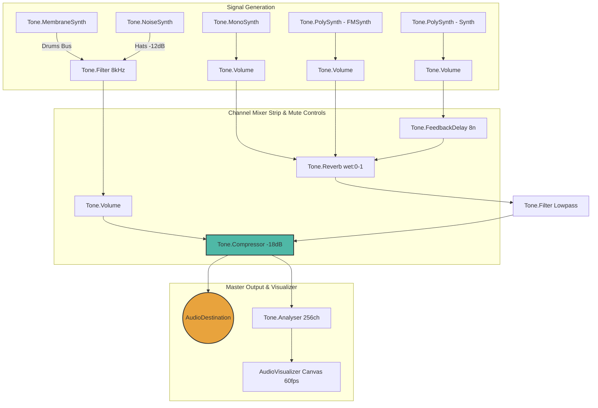
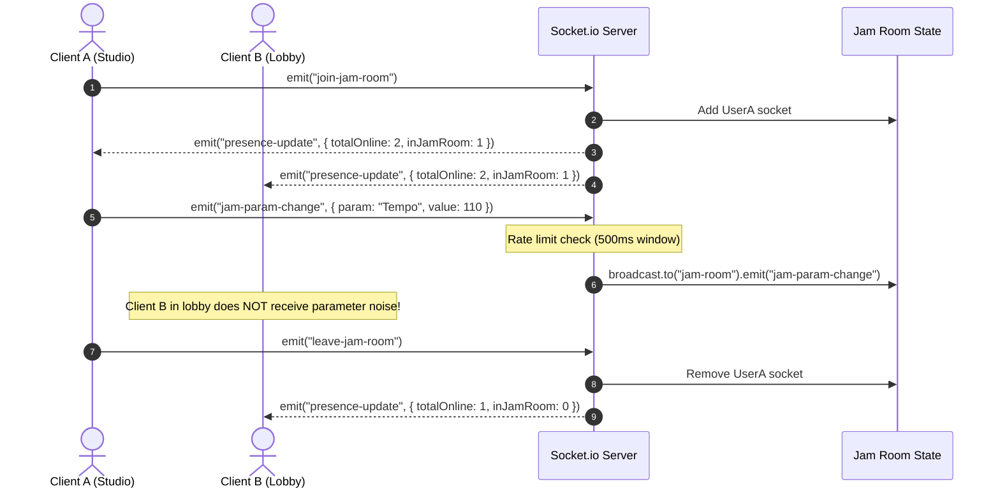
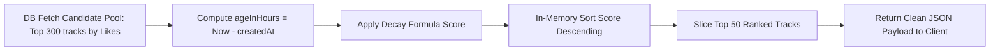
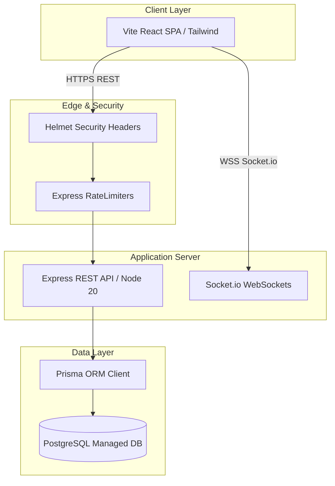

# CrowdStudio System Architecture & Technical Specifications

Welcome to the technical architecture documentation for **CrowdStudio** — a real-time collaborative music jamming platform combining client-side Web Audio API (Tone.js) synthesis with a high-throughput WebSocket & PostgreSQL backplane.

---

## 🛡️ Heroic Quality Gates (SVG Status Badges)

Below are the **Production Readiness Gates** enforced across CrowdStudio's architecture:

<div align="center">
  
  
  
  
  
</div>

---

## 🎵 1. Audio Signal Chain Architecture (Web Audio API / Tone.js)

The Jam Studio engine (`hooks/useJamEngine.ts`) processes 4 generative diatonic parts (Drums, Bass, Pads, Lead) through dedicated sub-channel volume nodes into a master DSP processing pipeline.



---

## ⚡ 2. Real-Time Room Scoping & WebSocket Protocol

WebSocket presence and ephemeral reactions use scoped Socket.io rooms (`socket.join("jam-room")` & `socket.join("track:id")`) with per-socket rate limiting to prevent memory leaks and room bleeding.



---

## 📈 3. Leaderboard Time-Decayed Ranking Math

Rather than relying on static like counts, CrowdStudio implements a time-decayed "hot" ranking formula (similar to Hacker News):

$$\text{Score} = \frac{\text{likes} \times 3 + \text{playCount}}{(\text{ageInHours} + 2)^{1.5}}$$



---

## 🏗️ 4. Full Deployment Topology (Render / Docker)



---

## 🎓 Udemy Course Showcase & Hands-on Lab Overview

### Module Matrix & Learning Objectives

| Module | Architectural Focus | Implemented Pattern |
|---|---|---|
| **Module 1: Web Audio Synthesis** | DSP nodes, Diatonic chord triads, Analyser taps | `useJamEngine.ts` |
| **Module 2: Scoped WebSockets** | Rate-limited room broadcasts, Ephemeral voting | `socket/index.ts` |
| **Module 3: Hardened REST APIs** | Zod input schemas, Status-preserving error handler | `routes/tracks.ts` |
| **Module 4: Algorithmic Ranking** | Time-decay math vs raw count decay | `lib/ranking.ts` |
| **Module 5: Docker & Cloud Deploy** | Container orchestrations & Render multi-service | `render.yaml` & `docker-compose.yml` |

---

## 🧪 Automated Verification & CI/CD Pipeline

To run the automated verification suite:

```bash
# Backend Test Suite (19 tests)
cd backend && npm test

# Frontend Test Suite (36 tests)
cd frontend && npm test

# Build Validations
cd backend && npm run build
cd frontend && npm run build
```
