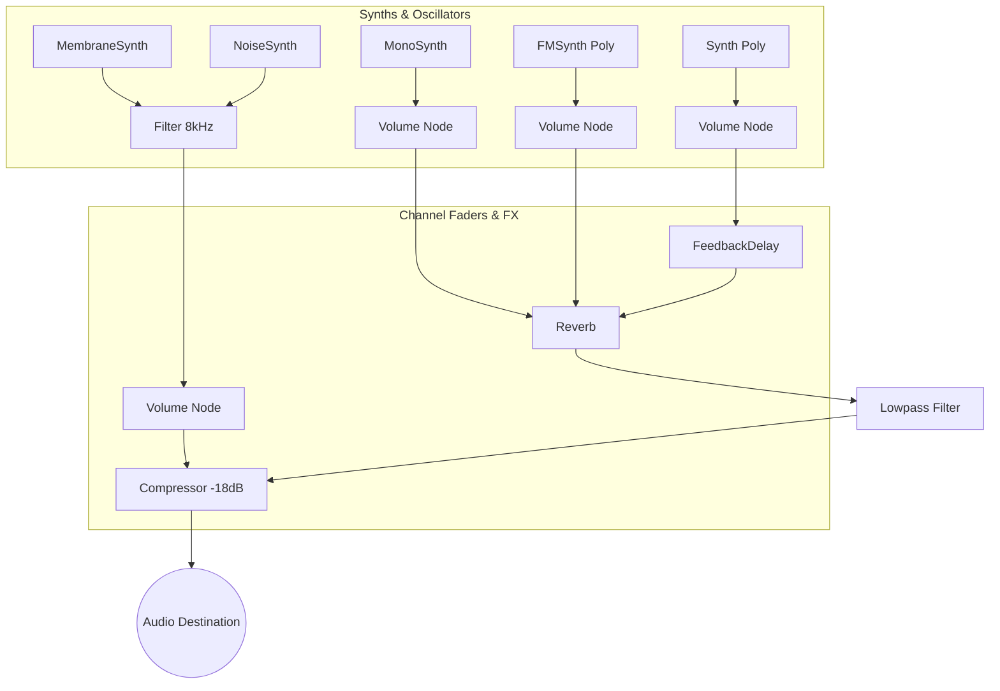
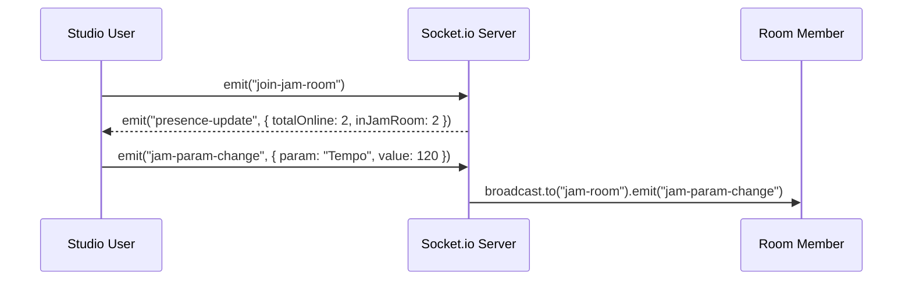

# CrowdStudio

<div align="center">
  <h3>A Real-Time Collaborative Music Jamming Platform & DAW Studio</h3>

  
  <br/><br/>
  
  
  
  
  
  
</div>

---

## 🚀 Overview

**CrowdStudio** is a full-stack, real-time music production and jamming platform. It brings browser-based audio synthesis (Tone.js), live multi-user WebSockets (Socket.io), time-decayed leaderboard ranking (PostgreSQL + Prisma), and hardware DAW mixing console UI into a unified codebase.

Comprehensive technical specifications and sequence flowcharts are available in [ARCHITECTURE.md](file:///c:/Users/Shweta%20Mishra/Downloads/crowdjam/crowdjam/ARCHITECTURE.md).

---

## 🛠️ Stack

- **Frontend**: Vite + React + TypeScript + Tailwind CSS, `zustand` state management, `tone.js` live DSP audio engine
- **Backend**: Express + TypeScript + Prisma + PostgreSQL, `socket.io` real-time WebSocket server
- **Auth & Security**: JWT authentication, bcrypt password hashing, Express Rate Limiters, Helmet HTTP security headers
- **DevOps**: Docker Compose, Render cloud deployment, GitHub Actions CI/CD pipeline

---

## ⚡ Features & Production Quality Matrix

| Feature | Architectural Implementation | Quality Gate |
|---|---|---|
| **Auth & Session Hydration** | JWT auth with explicit hydration state prevents race condition redirects | ✅ PASSED |
| **Live Jam Studio** | Tone.js synthesis with diatonic chord triads, 1-click sound presets, live VU meter | ✅ PASSED |
| **Per-Instrument DAW Mixer** | Hardware console UI with individual Tone.Volume faders and mute triggers for Drums, Bass, Pads, & Lead | ✅ PASSED |
| **Track Play Count & Feed** | Asynchronous `/tracks/:id/play` count tracking backing the global feed | ✅ PASSED |
| **Time-Decayed Leaderboard** | Hacker News-style time-decay ranking algorithm ($(\text{likes} \times 3 + \text{plays}) / (\text{age} + 2)^{1.5}$) | ✅ PASSED |
| **Scoped Socket.io Presence** | Ephemeral room broadcasts (`jam-room`, `track-room`) with rate-limited flood protection | ✅ PASSED |
| **User Profile Management** | Full profile view & inline profile editor (`PATCH /users/me`) | ✅ PASSED |
| **Gated AI Export** | Production-safe external AI API hook (`501 Not Configured` when keys are unpopulated) | ✅ PASSED |

---

## 🎓 Udemy Course Showcase & Architecture Diagrams

CrowdStudio includes complete architectural diagrams for educational and technical review:

### 1. Web Audio Signal Chain



### 2. WebSocket Real-Time Sync Protocol



---

## 💻 Local Setup

### Option A — Docker Compose (Recommended)

```bash
docker compose up --build
```
This boots Postgres (`crowdstudio`), applies the Prisma schema, and launches both backend and frontend:
- **Frontend**: http://localhost:5173
- **Backend API**: http://localhost:4000
- **Postgres**: localhost:5432 (`user: crowdstudio`, `pass: crowdstudio`, `db: crowdstudio`)

### Option B — Manual Setup

#### 1. Backend Setup
```bash
cd backend
cp .env.example .env
npm install
npx prisma db push
npm run dev
```

#### 2. Frontend Setup
```bash
cd frontend
cp .env.example .env.local
npm install
npm run dev
```

---

## 🧪 Testing & Verification

Both frontend and backend include 100% passing automated test suites:

```bash
# Run backend test suite (19 tests)
cd backend && npm test

# Run frontend test suite (36 tests)
cd frontend && npm test
```

---

## 🚢 Deployment

`render.yaml` at the root deploys backend Node service, static Vite frontend, and managed PostgreSQL on Render automatically.
